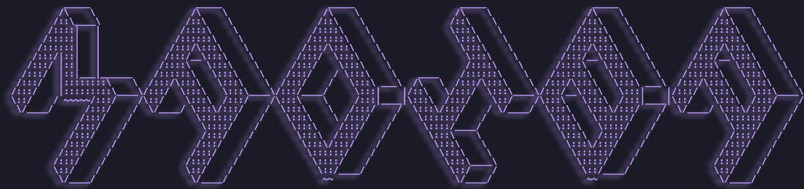

###

<h1 align="center">
  Hellos 👋🏼, I’m Elvis Madiba, currently on a journey to become a full-stack engineer and make meaningful contributions to the world of computer science.
</h1>

###

  
  
  
  
  
  
  
  
  
  
  
  
  
  
  
  
  
  
  
  
  
  
  
  
  
  
  
  
  
  
  
  
  
  
  
  
  
  
  
  
  
  
  
  
  
  
  

###

  
  

###

<h2 align="left">Currently working on</h2>

<h3 align="left">
  <a href="https://main.d1wj048yong21r.amplifyapp.com/" target="_blank" rel="noopener noreferrer">
    Kimu Foods
  </a>
</h3>

<h5 align="left">
  A <strong>recipe-based grocery delivery app</strong> that helps users shop for ingredients based on what they want to cook. 
  The mobile client is built in <strong>Flutter</strong>, and the backend uses <strong>GraphQL</strong>, powered by <strong>Apollo Server</strong> and <strong>Node.js</strong>.
</h5>

<h2 align="left">Recent blogs</h2>

<h6 align="left">
- <a href="https://diba-projects.netlify.app/craft/lazy-vim/" target="_blank" rel="noopener noreferrer">Neovim</a> 
- <a href="https://diba-projects.netlify.app/writing/astro/" target="_blank" rel="noopener noreferrer">Working with Astro</a> 
- <a href="https://diba-projects.netlify.app/writing/flutter-sdk/" target="_blank" rel="noopener noreferrer">Building a Flutter SDK</a>
</h6>

###

<h1 align="left"></h1>

###

  
  
  
  

###

###

<picture>
  <source media="(prefers-color-scheme: dark)" srcset="https://raw.githubusercontent.com/not-diba/not-diba/output/pacman-contribution-graph-dark.svg">
  <source media="(prefers-color-scheme: light)" srcset="https://raw.githubusercontent.com/not-diba/not-diba/output/pacman-contribution-graph.svg">
  
</picture>

###
